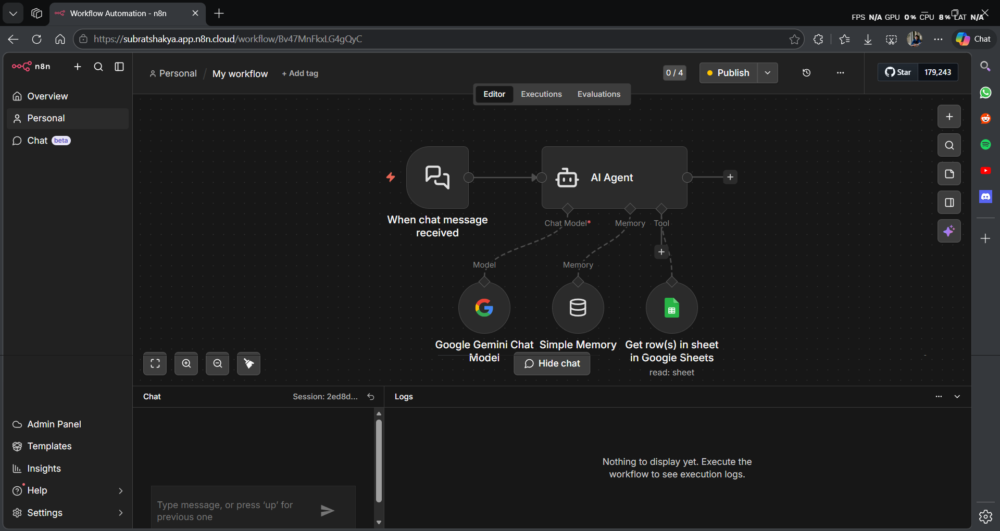
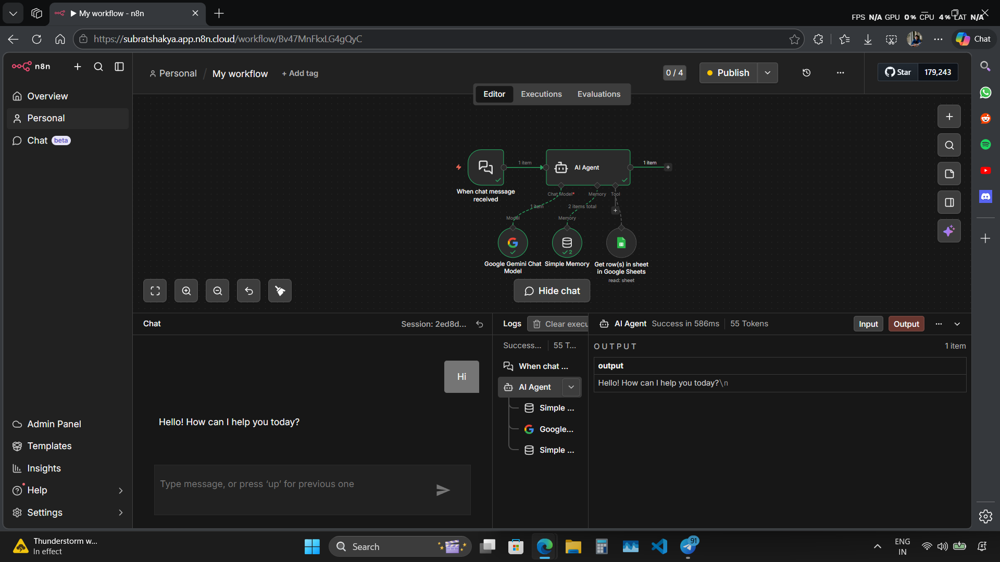
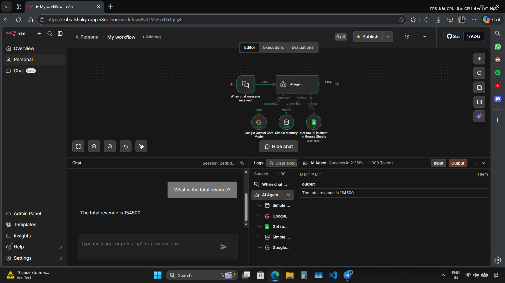
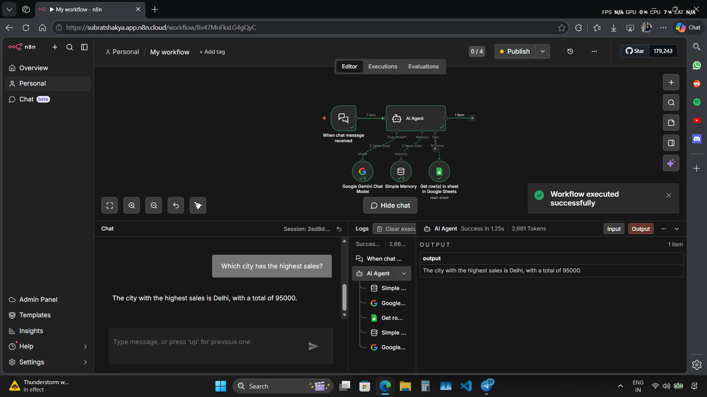
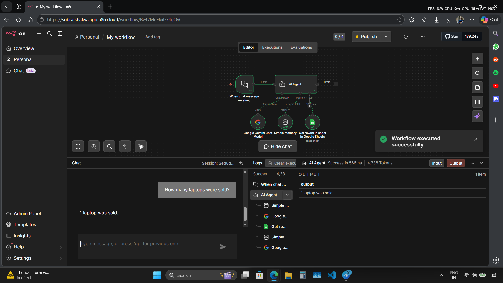
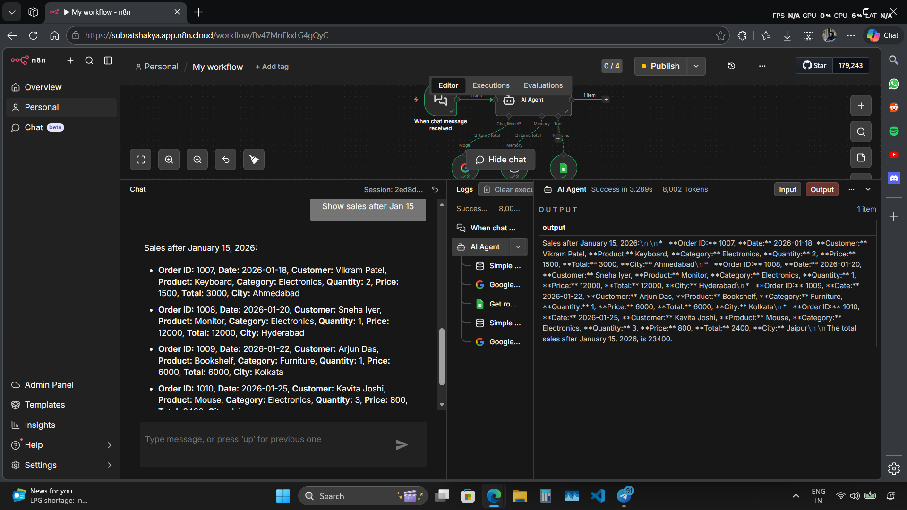

# Sales-Data-n8n-chat-bot

# n8n AI Chatbot with Google Sheets Integration

## Overview

This project is an **AI-powered chatbot built using n8n** that can interact with users, store conversation memory locally, and fetch or analyze data from **Google Sheets** using tools. The chatbot acts as an AI agent capable of answering questions, retrieving spreadsheet data, and automating workflows.

## Features

* AI chatbot powered by Google Gemini
* Local conversation memory
* Google Sheets integration for data retrieval
* Tool-based architecture for extending capabilities
* Workflow automation using n8n
* Easily extendable with APIs and other services

## Tech Stack

* n8n (workflow automation)
* Google Gemini
* Google Sheets API
* Webhooks for chatbot interaction

## Workflow Architecture

User Message
↓
Webhook Trigger
↓
Google Gemini
↓
Tool (Google Sheets)
↓
AI Response
↓
Chat Output

## Example Use Cases

The chatbot can answer questions such as:

* What are the total sales this month?
* Show all orders from Delhi.
* Which product sold the most?
* Retrieve order details by Order ID.

## Sample Google Sheets Structure

Order_ID	Date	Customer	Product	Category	Quantity	Price	Total	City
1001	2026-01-05	Rahul Sharma	Laptop	Electronics	1	65000	65000	Delhi
1002	2026-01-06	Priya Singh	Headphones	Electronics	2	2000	4000	Mumbai
1003	2026-01-08	Amit Kumar	Office Chair	Furniture	1	8500	8500	Bangalore
1004	2026-01-10	Neha Verma	Smartphone	Electronics	1	30000	30000	Delhi
1005	2026-01-12	Rohit Gupta	Desk Lamp	Furniture	3	1200	3600	Pune
1006	2026-01-15	Anjali Mehta	Tablet	Electronics	1	25000	25000	Chennai
1007	2026-01-18	Vikram Patel	Keyboard	Electronics	2	1500	3000	Ahmedabad
1008	2026-01-20	Sneha Iyer	Monitor	Electronics	1	12000	12000	Hyderabad
1009	2026-01-22	Arjun Das	Bookshelf	Furniture	1	6000	6000	Kolkata
1010	2026-01-25	Kavita Joshi	Mouse	Electronics	3	800	2400	Jaipur

### 1. Create Workflow

1. Create a new workflow in n8n.
2. Add the following nodes:

   * Webhook
   * AI Agent
   * Google Sheets (tool)
   * Respond to Webhook

### 2. Configure Google Sheets

1. Add Google Sheets OAuth2 credentials in n8n.
2. Connect your spreadsheet.
3. Configure the node to read rows from the sheet.

### 3. Configure AI Agent Tools

Add the Google Sheets node as a tool for the AI agent with a description such as:

```
Use this tool to retrieve sales or order data from the spreadsheet.
```

## Example Queries

Users can ask questions like:

```
What are the total sales?
Show all orders from Mumbai.
Which category generated the most revenue?
```

## Future Improvements

* Add Redis-based long-term memory
* Add document search (RAG)
* Integrate Telegram or WhatsApp chat interface
* Add analytics and dashboarding
* Deploy n8n on cloud server for 24/7 access

## Project Structure

```
n8n-ai-chatbot
│
├── workflow.json
├── README.md
└── docs
```

## Screenshots










## License

This project is open-source and available under the MIT License.
